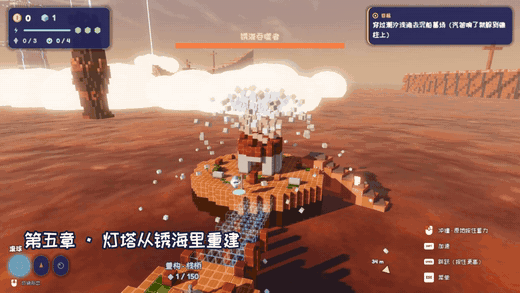

# 方舟星球 Voxel Ark（立方-7 Cube-7）

一颗星球为了活下去，被拆成了漂浮在云海上的方块。你是维修机器人 **PIX**——一颗会变形的小球：
**撞碎、钻穿、砸塌**这个体素世界，再把收集到的“重构物质”变成瞭望台、栈桥和灯塔，一块块**重建**回来。

奥德赛 / 喷射战士式的柔和画风 + 科幻内核的 3D 体素箱庭探索冒险，Godot 4 + Voxel Tools 制作。自然地形是圆润的平滑体素，人造物是圆角积木。

▶ [75 秒实机演示视频（mp4）](https://github.com/infinitytom/cube7/raw/downloads/VoxelArk-demo.mp4)

## 下载游玩（Windows）

1. 到 [Releases](https://github.com/infinitytom/cube7/releases/latest) 下载最新的 `VoxelArk-windows-x64.zip`（v2.1）。
2. 解压，双击 `VoxelArk.exe`。无需安装。
3. 需要支持 Vulkan 或 Direct3D 12 的显卡（近几年的独显/核显都可以）。
4. 已经玩过旧版也可以直接覆盖：存档兼容，旧存档里已通关的章节会视为已拿到芯片。

存档位置：`%APPDATA%\Godot\app_userdata\方舟星球 Voxel Ark\`。

## 内容

- **六个章节**：翠绿温室群岛 → 齿轮工坊 → 晶簇深渊 → 天空城市 → 锈海 → 星核（终章 + 结局）。
- **每章的主线：探索 → 关键道具 → Boss**。用回声扫描在地层里找到本章的「进化芯片」，拿到它 PIX 就进化出新能力，
  也只有它能打碎 Boss 身上的锈封印——而这一章的 Boss 正好要用到这个新能力。
- **破坏与重构**：地形按材质分档可破坏；拆下来的东西变成重构物质，用来重建建筑、桥梁、灯塔。
- **三种形态**：滚球（冲撞 / 蓄力冲撞）、钻头（钻地 / 空中下砸）、气泡（气浪 / 泡泡弹 / 二段跳）。
- **Boss 战**：锈根兽（用落石砸裂它的岩甲）、熔炉守卫、晶簇巨像、锈蚀飞艇、锈海吞噬者、锈蚀之心。
- **改装系统**：用金币给 PIX 升级护盾、冲角、蓄力等 8 项能力。
- **关卡编辑器**：自己摆方块、敌人和机关，一键试玩；导出 `.cube7` 文件分享给朋友（拖进游戏窗口即可导入）。
- **回声扫描与形态进化**：声呐隔着地层找到埋起来的回声晶核和芯片，进化出能钻穿崖壁、撞开岩石的新能力；
  地下洞穴、落石陷阱、塌方堆，到处都是可以挖开的秘密。
- **哑光的平滑地形**：草、土、岩、沙由 Voxel Tools 生成圆润的平滑曲面并混合材质，每种材质有自己的表面质感；破坏是真实的碎裂和崩塌，不再是方块。
- 手柄优先（PS5 / Xbox 图标自动切换，带震动），键鼠同样完整支持。

## 操作

| 功能 | PS5 | Xbox | 键鼠 |
| --- | --- | --- | --- |
| 移动 | 左摇杆 | 左摇杆 | WASD / 方向键 |
| 镜头 | 右摇杆 | 右摇杆 | 鼠标 |
| 跳跃（按住更高） | ✕ | A | 空格 |
| 形态能力（冲撞 / 钻 / 气浪；原地按住蓄力） | □ | X | 鼠标左键 / F |
| 抓取 / 投掷 | ○ | B | E / 鼠标右键 |
| 加速 | R2 | RT | Shift |
| 切换形态 | L1 / R1 | LB / RB | 滚轮 / Z、C |
| 直选形态 | 十字键 | 十字键 | 1–3 |
| 俯视全景 | △ | Y | V |
| 回声扫描 | L2 | LT | Q / 鼠标中键 |
| 回到检查点 | Create | View | R |
| 暂停 / 菜单 | Options | Menu | Esc |

## 从源码运行

1. 推荐用带 [Voxel Tools](https://github.com/Zylann/godot_voxel) 模块的 Godot 4.7（地形由 Transvoxel 生成，速度快、有材质混合）；
   标准版 Godot 4.7 也能打开，平滑地形会自动改用内置的 GDScript 版本。
2. 用 Godot 打开本仓库的 `project.godot`，按 F5。
3. 导出：`godot --headless --path . --export-release "Windows" export/windows/VoxelArk.exe`（需先安装对应版本的导出模板）。

自动测试（无界面）：`godot --headless --path . -- --autotest=greenhouse`（章节 id：greenhouse / gearworks / abyss / city / rust / core）。

开发记录见 [docs/DEVLOG.md](docs/DEVLOG.md)，剧情设定见 [docs/STORY.md](docs/STORY.md)，探索 / 战斗 / 进化设计见 [docs/DESIGN_EXPLORE.md](docs/DESIGN_EXPLORE.md)。

## 支持作者

游戏完全免费。标题画面里的「赞赏作者」可以请作者喝杯咖啡 ☕
